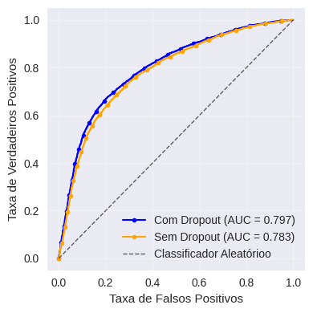
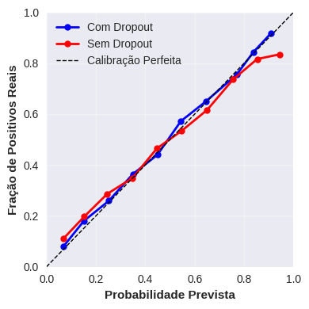

# Universidade Federal de Pernambuco

\vspace{-.4cm}

# Centro de Ciências Exatas e da Natureza

\vspace{-.4cm}

# Departamento de Estatística

\vspace{.5cm}

```{r, eval=TRUE, echo=FALSE}
data <- format(Sys.Date(), "%d de %B de %Y")
```

## TÓPICOS ESPECIAIS EM ESTATÍSTICA COMPUTACIONAL

\vspace{.2cm}

### TITULO: MLP com e sem Dropout na Classificação de Risco Cardiovascular: Uma Análise Comparativa

\vspace{.5cm}

## Martha Liliana Huertas Madrid

\vspace{.5cm}

**Data:** `r data` \vspace{.5cm}

# 1. Introdução.

As doenças cardiovasculares (DCV) são a principal causa de mortalidade mundial, causando aproximadamente 17,9 milhões de mortes anuais. Na América Latina, representam 30% dos óbitos, com tendência crescente devido ao envelhecimento populacional e fatores de risco como hipertensão, diabetes e obesidade.A identificação precoce permitiria intervenções preventivas que salvariam vidas e reduziriam custos. Os escores tradicionais como Framingham e SCORE, baseados em modelos lineares, não capturam relações não lineares complexas e apresentam limitações de generalização por terem sido desenvolvidos em populações específicas.

As Redes Neurais Multicamadas (MLP) oferecem alternativa promissora ao modelar interações complexas em dados clínicos. Porém, enfrentam o desafio do sobreajuste (overfitting), que compromete a generalização. O Dropout, técnica que desativa aleatoriamente neurônios durante o treinamento, reduz esse problema melhorando a robustez do modelo. Este trabalho compara modelos MLP com e sem Dropout na classificação de risco cardiovascular, fornecendo evidência sobre o papel da regularização na melhoria da precisão preditiva e capacidade de generalização.

# 2. Fundamentos Teóricos e Metodológicos

## 2.1. Redes Neuronales Artificiales

As Redes Neurais Artificiais (RNAs) são modelos computacionais inspirados no funcionamento do cérebro biológico, especificamente na forma como os neurônios processam e transmitem informações. Assim como o cérebro humano é composto por bilhões de neurônios interconectados, as RNAs consistem em unidades de processamento simples (neurônio artificial) organizadas em camadas.[@teec2024neuralintro]

### 2.1.1. Arquitectura MLP Implementada

**Função de ativação ReLU:** $$f(x) = max(0, x)$$

**Função de ativação Sigmoid:** $$f(x) = \frac{1}{1 + e^{-x}}$$

## 2.2. Técnicas de Regularização

### 2.2.1. Dropout

O Dropout é uma técnica de regularização que previne o sobreajuste (overfitting) ao desativar neurônios aleatoriamente durante o treinamento [@teec2024dropout].

### 2.2.2. Função de Perda

**Entropia Cruzada Binária (Binary Cross-Entropy):** $$\mathcal{L} = -\frac{1}{N} \sum_{i=1}^{N} [y_i \log(\hat{y}_i) + (1-y_i) \log(1-\hat{y}_i)]$$ Essa função é amplamente utilizada em problemas de classificação binária, pois mede a diferença entre as probabilidades previstas pelo modelo.

## 2.3. Otimização com Adam

Algoritmo que adapta a learning rate por parâmetro:

$$m_t = \beta_1 m_{t-1} + (1-\beta_1)g_t$$ $$v_t = \beta_2 v_{t-1} + (1-\beta_2)g_t^2$$ $$\theta_t = \theta_{t-1} - \alpha\frac{\hat{m}_t}{\sqrt{\hat{v}_t} + \epsilon}$$

## 2.4. Métricas de Avaliação

### 2.4.1.Matriz de Confusão

A matriz de confusão é uma ferramenta utilizada para avaliar o desempenho de modelos de classificação. Ela organiza os resultados previstos pelo modelo em comparação com os valores reais, permitindo identificar acertos e erros em cada classe.

$$
\begin{array}{c|cc}
 & \text{Predição 0} & \text{Predição 1} \\
\hline
\text{Real 0} & TN & FP \\
\text{Real 1} & FN & TP \\
\end{array}
$$

### 2.4.2. Métricas Principais

-   Accuracy: $\frac{VP + VN}{Total}$

-   Precision: $\frac{VP}{VP + FP}$

-   Recall: $\frac{VP}{VP + FN}$

-   F1-Score: $2\times\frac{Precision \times Recall}{Precision + Recall}$

### 2.4.3. Curva ROC y AUC

A curva ROC mostra o trade-off entre a Taxa de Verdadeiros Positivos (TPR) e a Taxa de Falsos Positivos (FPR):

$$TPR = \frac{TP}{TP + FN}$$ $$FPR = \frac{FP}{FP + TN}$$

O AUC (Area Under Curve) quantifica a capacidade discriminativa do modelo em todos os limiares (thresholds). \[@teec2024assessing

# 3. Aplicação

## 3.1. Descrição do Dataset e Análise Exploratória

Foi utilizada a base de dados Cardiovascular Disease, que contém 70.000 registros de pacientes com 12 variáveis clínicas coletadas por meio de exames médicos.

|         **Grupo de pacientes**          |   **n**    |  **%**   |
|:---------------------------------------:|:----------:|:--------:|
|         **Pacientes saudáveis**         |   35.021   |  50.03%  |
| **Pacientes com doença cardiovascular** |   34.979   |  49.97%  |
|                **Total**                | **70,000** | **100%** |

: Distribuição de pacientes {#tbl-distribucion}

\begin{center}
\footnotesize \textit{Fonte: Elaboração própria}
\end{center}

A @tbl-distribucion detalha a composição do conjunto de dados, revelando uma distribuição balanceada das classes-alvo: 49,97% corresponde a pacientes com diagnóstico positivo de doença cardiovascular, enquanto os 50,03% restantes representam pacientes sem a patologia.

**Variáveis do Dataset:**

-Demográficas: idade, gênero, altura, peso, BMI (Masa corporal)

-Sinais vitais: pressão arterial sistólica e diastólica

-Fatores de risco: Colesterol (1: normal, 2: alto, 3: muito alto), Glicose (1: normal, 2: alto, 3: muito alto)

-Hábitos: tabagismo, consumo de álcool, atividade física

-Variável alvo: presença de doença cardiovascular (1: sim, 0: não)

**Estatísticas Descritivas:**

|   **Variável**    | **Média** | **Desvio Padrão** | **Mínimo** | **Máximo** |
|:-----------------:|:---------:|:-----------------:|:----------:|:----------:|
| **Idade (anos)**  |   53.3    |        6.8        |     39     |     65     |
|  **IMC (kg/m²)**  |   27.6    |        4.8        |    15.2    |    49.8    |
|  **P.Sistólica**  |   128.6   |       18.2        |     90     |    180     |
| **P. Diastólica** |   96.6    |       11.8        |     60     |    120     |
|  **Altura (cm)**  |   164.4   |        8.2        |    145     |    185     |
|   **Peso (kg)**   |   74.2    |       14.1        |     41     |    120     |

: Estatística Descriptivas {#tbl-est}

\begin{center}
\footnotesize \textit{Fonte: Elaboração própria}
\end{center}

Na @tbl-est a população apresentou uma idade média de 53,3 anos (DP: 6,8) e um IMC de 27,6 kg/m² (DP: 4,8), situando-se na faixa de meia-idade com predominância de sobrepeso. As medições de pressão arterial mostraram valores médios de 128,6/96,6 mmHg, dentro dos intervalos de pré-hipertensão.

# 3.2 Pré-processamento de Dados

Uma vez concluída a análise exploratória, os dados foram preparados para o modelamento preditivo, selecionando doze variáveis como preditores: idade, gênero, altura, peso, IMC, pressão arterial sistólica e diastólica, níveis de colesterol e glicose, tabagismo, consumo de álcool e atividade física. A variável alvo foi o diagnóstico de doença cardiovascular, definindo um problema de classificação binária. Para o pré-processamento, as variáveis categóricas (colesterol e glicose) foram transformadas por meio de codificação one-hot, expandindo o conjunto para catorze variáveis preditoras. Os dados foram divididos em 70% para treinamento e 30% para teste com amostragem estratificada, e todas as variáveis numéricas foram padronizadas.

# 3.3 Arquitetura do Modelo

Foi projetada uma rede neural multicamada com catorze entradas e três camadas ocultas em progressão decrescente: 128, 64 e 32 neurônios respectivamente, utilizando a função de ativação ReLU. Essa arquitetura progressiva permite ao modelo aprender representações hierárquicas dos dados, capturando relações complexas entre variáveis sem gerar sobreajuste. A camada de saída conta com um neurônio e ativação sigmoide, gerando probabilidades interpretáveis de risco cardiovascular no intervalo \[0,1\].

Foram desenvolvidas duas versões do modelo com arquitetura idêntica: uma incorporando dropout com taxas progressivas (40%, 30%, 20%) nas camadas ocultas, e outra sem qualquer regularização.

Ambos os modelos foram treinados com entropia cruzada binária como função de perda, otimizador Adam com taxa de aprendizado de 0,001, 50 épocas de treinamento, tamanho de lote de 128 amostras e 20% do conjunto de treinamento reservado para validação. O desempenho foi avaliado por meio das métricas de exatidão (accuracy) e área sob a curva ROC (AUC). A @tbl-comp apresenta as métricas de classificação obtidas no conjunto de teste para ambas as arquiteturas.

| **Métricas** | **MLP com Dropout** | **MLP sem Dropout** |
|:------------:|:-------------------:|:-------------------:|
|     AUC      |       0.7984        |       0.7828        |
|   Accuracy   |       0.7326        |       0.7222        |
|   Precisão   |       0.7514        |       0.7405        |
|    Recall    |       0.6859        |       0.6740        |
|   F1-Score   |       0.7172        |       0.7057        |

: Comparação dos Modelos {#tbl-comp}

\begin{center}
\footnotesize \textit{Fonte: Elaboração própria}
\end{center}

A @tbl-comp mostra que o modelo com dropout superou o modelo sem regularização em todas as métricas. O modelo regularizado alcançou um AUC de 0,7984 comparado com 0,7828, uma acurácia de 73,26% frente a 72,22%, precisão de 75,14% comparado com 74,05%, recall de 68,59% frente a 67,40% e F1-Score de 71,72% frente a 70,57%. Esses resultados demonstram que o dropout melhora a capacidade preditiva do modelo.


{#fig-conysim fig-align="center" width="100%"}

\begin{minipage}{\textwidth}
\centering
\vspace{-10pt}
\footnotesize \textit{Fonte: Elaboração própria}
\end{minipage}

A @fig-conysim confirma a superioridade do modelo regularizado através das curvas de aprendizagem. O modelo sem dropout apresenta overfitting evidente, com divergência acentuada entre treino e validação, indicando memorização sem generalização adequada. Já o modelo com dropout exibe curvas mais próximas e paralelas, com perda de validação decrescente e estável, demonstrando aprendizado de padrões generalizáveis. A suavidade das trajetórias contrasta com as flutuações do modelo não regularizado, evidenciando maior estabilidade na otimização.


Esta capacidade de generalização se reflete de maneira significativa na métrica de discriminação do modelo, um dos indicadores mais importantes para avaliar o desempenho preditivo em problemas de classificação binária. A área sob a curva ROC (AUC), cujos valores numéricos são apresentados na @tbl-comp, é visualizada graficamente na @fig-curvaor, que permite uma comparação detalhada do desempenho discriminativo de ambos os modelos ao longo de diferentes limiares de classificação.

A análise da curva apresentada na @fig-curvaor revela que o modelo com dropout mantém uma taxa de verdadeiros positivos consistentemente superior em toda a faixa de taxas de falsos positivos, desde os valores mais baixos até os mais elevados. Este comportamento uniforme ao longo de todo o espectro de limiares confirma sua melhor capacidade de distinguir entre pacientes com e sem risco cardiovascular, independentemente do ponto de corte escolhido para a tomada de decisão clínica. A diferença observada de 0,014 pontos na AUC, embora possa parecer numericamente modesta à primeira vista, representa na verdade uma melhoria relevante e clinicamente significativa no contexto da predição de risco cardiovascular. Em ambientes clínicos reais, onde decisões sobre intervenções preventivas, prescrição de medicamentos ou encaminhamento para procedimentos especializados dependem crucialmente da precisão das estimativas de risco, cada ponto percentual adicional na capacidade de discriminação pode ter impactos substanciais nas decisões médicas e, consequentemente, nos desfechos de saúde dos pacientes. Esta melhoria na discriminação traduz-se em uma capacidade aprimorada de identificar corretamente os pacientes que realmente necessitam de intervenção, ao mesmo tempo que reduz falsos alarmes que poderiam resultar em tratamentos desnecessários e custos evitáveis ao sistema de saúde.


Além da capacidade discriminativa avaliada pelas curvas ROC, é crucial examinar a qualidadedas probabilidades geradas pelo modelo. Em aplicações clínicas, não basta que o modelo dis-tinga bem entre classes; as probabilidades preditas devem refletir com precisão o risco real dospacientes. A calibração adequada é fundamental para que os profissionais de saúde possam tomar decisões terapêuticas confiáveis, baseando-se nas estimativas de risco fornecidas.


{#fig-curvaor fig-align="center"}

\begin{minipage}{\textwidth}
\centering
\vspace{-10pt}
\footnotesize \textit{Fonte: Elaboração própria}
\end{minipage}


{#fig-calibracion fig-align="center"}

\begin{minipage}{\textwidth}
\centering
\vspace{-10pt}
\footnotesize \textit{Fonte: Elaboração própria}
\end{minipage}


A @fig-calibracion mostra que o modelo com dropout está mais alinhado com a linha de calibração perfeita, indicando que suas probabilidades previstas refletem com maior precisão a proporção real de resultados positivos.

# 4. Conclusão

Este estudo demonstrou a eficácia do dropout como técnica de regularização em redes neurais multicamadas para classificação de risco cardiovascular. O modelo regularizado superou o modelo base em todas as métricas As curvas de aprendizagem confirmaram que o dropout controla eficazmente o overfitting, mantendo convergência estável entre treino e validação. Adicionalmente, a análise de calibração revelou que o modelo regularizado gera probabilidades mais confiáveis, aspecto crucial para aplicações clínicas onde as predições impactam decisões médicas. Os resultados evidenciam que a regularização via dropout é essencial para desenvolver modelos preditivos robustos em saúde, equilibrando adequadamente complexidade e capacidade de generalização.

# 5. Referencias Bibliograficas

::: {#refs}
:::
